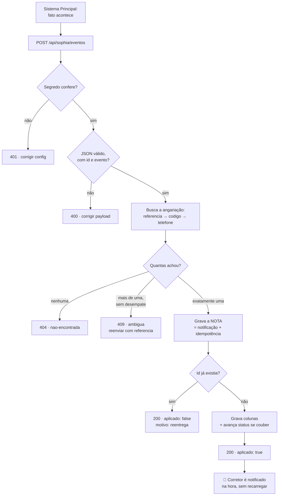
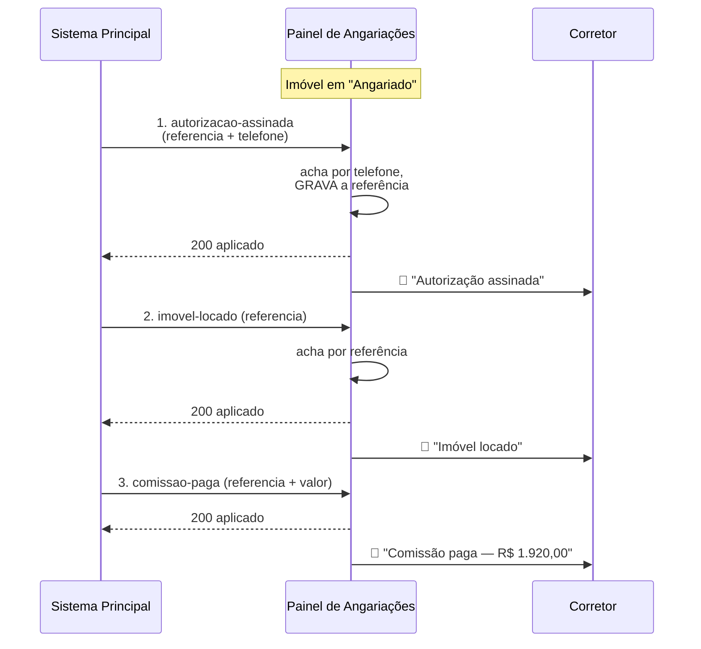

# Integração Sistema Principal (Sophia) → Painel de Angariações

> **Para quem é este documento:** a pessoa que vai escrever o código do **Sistema Principal** que
> notifica o Painel de Angariações. Ele é autossuficiente — não é preciso ler o código do painel
> para implementar a integração.
>
> **Versão da API:** 1 · **Última revisão:** 2026-08-06

---

## 1. Objetivo

O Painel de Angariações é o CRM que o corretor usa para **captar** imóveis para locação: do
primeiro contato com o proprietário até o "sim". O que acontece **depois** do sim — a Autorização
de Locação assinada, o contrato de locação e o pagamento da comissão — acontece no **Sistema
Principal**, e o painel ficava cego a isso. Na prática, o corretor descobria que a própria comissão
tinha sido paga perguntando para alguém.

Esta integração fecha esse buraco com uma regra única:

> **O Sistema Principal é a fonte oficial dos três fatos. O Painel de Angariações apenas RECEBE.**

O painel não decide que uma comissão foi paga, não devolve nada ao Sistema Principal e não tem
nenhum caminho de escrita no sentido contrário. Toda regra de negócio (quem assina, quando loca,
quanto paga) continua do lado de vocês. É isso que evita a pior coisa que uma integração cria: dois
sistemas achando que mandam no mesmo dado.

O que o painel faz ao receber um evento:

1. localiza a angariação correspondente;
2. avança o status no funil (quando cabe) e grava os dados do fato;
3. cria uma **notificação não lida** para o corretor que angariou o imóvel;
4. registra tudo num histórico de auditoria.

---

## 2. Endpoint

| | |
|---|---|
| **URL (produção)** | `https://SEU-DOMINIO/api/sophia/eventos` |
| **Método** | `POST` |
| **Content-Type** | `application/json` |
| **Charset** | UTF-8 |
| **Teste de vida** | `GET` na mesma URL |

> Substitua `SEU-DOMINIO` pelo domínio informado pela equipe do painel.

### 2.1 Autenticação

Um segredo compartilhado, definido na variável de ambiente `SOPHIA_WEBHOOK_SECRET` do painel. Ele
pode ser enviado de **duas formas** — use a que for mais fácil no seu cliente HTTP:

**Forma A — header (preferida):**

```
x-webhook-secret: <o segredo>
```

**Forma B — último segmento da URL** (para clientes que não permitem header customizado):

```
POST https://SEU-DOMINIO/api/sophia/eventos/<o segredo>
```

Quando o header está presente, ele tem prioridade sobre a URL.

**Por que existe:** o segredo não esconde nada de vocês — esses dados são de vocês. Ele impede que
qualquer um na internet forje "a comissão foi paga" ou "o imóvel foi locado", o que mexeria no
funil, na taxa de conversão e no faturamento exibido ao corretor.

**Cuidados:** trate-o como senha. Não versione, não coloque em log, não exponha em front-end. Se
usar a Forma B, lembre que URLs entram em log de proxy e em `Referer` — a Forma A é mais segura.

### 2.2 Headers

| Header | Obrigatório | Valor |
|---|---|---|
| `Content-Type` | sim | `application/json` |
| `x-webhook-secret` | sim¹ | o segredo |

¹ A menos que esteja usando a Forma B (segredo na URL).

### 2.3 Teste de vida

Antes de disparar qualquer evento real, confirme URL e segredo:

```bash
curl -i -H "x-webhook-secret: SEU_SEGREDO" \
  https://SEU-DOMINIO/api/sophia/eventos
```

Resposta esperada:

```json
{ "ok": true, "pronto": true }
```

`401` significa segredo errado. `503` significa que o painel ainda não configurou a variável de
ambiente — avise a equipe deles.

---

## 3. Os três eventos

### Campos comuns a todos

| Campo | Tipo | Obrigatório | Observação |
|---|---|---|---|
| `evento` | string | **sim** | `autorizacao-assinada`, `imovel-locado` ou `comissao-paga` |
| `id` | string | **sim** | Id do evento **no seu sistema**. Estável e único. É a chave de idempotência — ver §6 |
| `referencia` | string | ver §5 | Referência do imóvel no Sistema Principal |
| `telefone` | string | ver §5 | Telefone do proprietário, em qualquer formatação |
| `codigo` | string | não | Código da angariação no painel, se vocês o guardarem |
| `endereco` | string | recomendado | Só para desempate — ver §5.3 |
| `unidade` | string | recomendado | Idem (apto/sala), quando o imóvel é de prédio |
| `data` | string | não | Data do fato. Ausente = o dia em que o evento chegou |

**Sobre `data`:** aceita ISO (`2026-08-05`, inclusive com hora colada: `2026-08-05T14:30:00Z`) e o
formato brasileiro (`05/08/2026`). Datas impossíveis (`32/13/2026`) são tratadas como ausentes.
**Prefira ISO.**

**Sobre os nomes dos campos:** o painel aceita `camelCase` e `snake_case`, e vários sinônimos
(`referenciaCrm`, `referencia_crm`, `numeroContrato`, `numero_contrato`, `dataAssinatura`…). Os
dados podem vir na raiz do JSON ou aninhados em `dados`, `data` ou `payload`. Isso existe para a
integração não quebrar por causa de um underline — mas **use os nomes da tabela acima**, que são os
canônicos.

---

### Evento 1 — Autorização de Locação assinada

Dispare quando o proprietário assinar a Autorização de Locação.

| Campo | Tipo | Obrigatório | Observação |
|---|---|---|---|
| `responsavel` | string | não | Quem registrou a assinatura no Sistema Principal |

```json
{
  "evento": "autorizacao-assinada",
  "id": "evt-1029",
  "referencia": "02256.001",
  "telefone": "(43) 99802-4316",
  "endereco": "Rua José Francisco Pereira, 800",
  "data": "2026-08-04",
  "responsavel": "Marina Souza"
}
```

**Efeito no painel:**

- status → **`Autorização assinada`** (etapa do funil entre "Angariado" e "Publicado");
- grava a data da assinatura e o responsável;
- **grava a `referencia` recebida no imóvel**, se ele ainda não tiver uma. É assim que a referência
  vira o **id compartilhado** entre os dois sistemas — ver §5.1;
- notifica o corretor.

> ⚠️ **Este é o evento em que o `telefone` mais importa.** Ver §5.1.

---

### Evento 2 — Imóvel locado

Dispare quando o contrato de locação for fechado.

| Campo | Tipo | Obrigatório | Observação |
|---|---|---|---|
| `contrato` | string | não | Número do contrato de locação |

```json
{
  "evento": "imovel-locado",
  "id": "evt-1104",
  "referencia": "02256.001",
  "data": "2026-08-20",
  "contrato": "C-9912"
}
```

**Efeito no painel:** status → **`Locado`**, grava a data da locação e o número do contrato,
notifica o corretor.

---

### Evento 3 — Comissão paga

Dispare quando o financeiro registrar o pagamento da comissão de angariação.

| Campo | Tipo | Obrigatório | Observação |
|---|---|---|---|
| `valor` | número ou string | **fortemente recomendado** | Valor pago. Ver abaixo |
| `formaPagamento` | string | não | "PIX", "Transferência", "Folha"… |
| `observacao` | string | não | Texto livre do financeiro |

```json
{
  "evento": "comissao-paga",
  "id": "evt-1211",
  "referencia": "02256.001",
  "data": "2026-09-05",
  "valor": 1920.00,
  "formaPagamento": "PIX",
  "observacao": "Fechamento de agosto"
}
```

**Efeito no painel:** marca a comissão como recebida com data, valor e forma; notifica o corretor.
**Não mexe no status** — a comissão é paga depois da locação, e criar uma etapa para ela poria uma
transição falsa no histórico do funil.

**Sobre o `valor`:**

- aceita número (`1920.00`, **preferido**) ou string (`"1920.00"`, `"1.920,00"`, `"R$ 1.920,00"`);
- **valor ilegível vira ausente, nunca zero.** `"a combinar"` não grava R$ 0,00 — grava "sem valor
  informado". Isso é deliberado: um zero somaria em silêncio numa tela de dinheiro;
- **sem `valor`, o painel NÃO inventa um.** Ele continua exibindo a própria estimativa e a marca
  como estimativa. Mandar o valor real é o que faz a tela do corretor bater com o extrato dele.

---

## 4. Ordem recomendada dos eventos

```
1. autorizacao-assinada  →  2. imovel-locado  →  3. comissao-paga
```

**Por que a ordem importa:** o Evento 1 é o que **grava a referência** no painel. Depois dele, os
eventos 2 e 3 casam pela referência — que é uma chave forte e sem ambiguidade. Antes dele, o
casamento depende do telefone, que é mais frágil (§5.3).

**O painel tolera fora de ordem**, mas com uma regra que vocês precisam conhecer:

> **O status só ANDA para a frente.** Um evento de assinatura que chega depois de o imóvel já estar
> "Locado" **não** o traz de volta para trás. Os dados do fato (data da assinatura, responsável)
> são gravados normalmente — só a etapa do funil não retrocede.

Motivo: eventos chegam fora de ordem quando uma fila é reprocessada ou a integração é religada, e
desfazer um desfecho melhor com um evento antigo é pior que perder o evento.

**Uma exceção deliberada:** imóvel que está **fora** do funil no painel (Perdido, Cancelado, Sem
resposta) **sempre avança**. Se de vocês vem que o contrato foi assinado, o "Perdido" registrado no
painel era o corretor tendo desistido de um negócio que a imobiliária fechou — e recusar a correção
manteria na carteira uma derrota que não aconteceu.

---

## 5. Como o painel encontra a angariação

Esta é a parte que mais afeta a taxa de sucesso da integração. Leia com atenção.

O painel tenta **três chaves, nesta ordem**, e para na primeira que encontrar alguma coisa:

```
1. referencia (referência do CRM)   →  2. codigo  →  3. telefone canônico
```

### 5.1 Por que o telefone é essencial no Evento 1

A referência do CRM é uma chave excelente — mas ela **nasce tarde**. Medição feita na base real do
painel em 05/08/2026, na conta de uma supervisora com 640 imóveis:

| Status no painel | Imóveis | Com `referencia_crm` |
|---|---:|---:|
| Locado | 101 | **101 (100%)** |
| Publicado | 42 | **42 (100%)** |
| Angariado | 497 | **3 (0,6%)** |

E, em toda a base (849 imóveis, todas as contas): **zero** referências repetidas.

Ou seja: a referência é criada no Sistema Principal **no momento da assinatura**. No instante do
Evento 1, o painel ainda não a conhece — e um casamento só por referência falharia justo no
primeiro evento, o que na prática é falhar em todos (sem o primeiro, os outros nunca encontram
nada).

> ✅ **Regra prática: no Evento 1, envie `referencia` E `telefone`.** A referência para o painel
> gravar, o telefone para ele achar o imóvel.

### 5.2 Como o telefone é comparado

O painel normaliza o telefone antes de comparar (a mesma normalização que ele usa para receber
mensagens de WhatsApp). Você pode mandar em **qualquer formatação**:

| O que você manda | Como fica |
|---|---|
| `(43) 99802-4316` | `4398024316` |
| `+55 43 99802-4316` | `4398024316` |
| `5543998024316` | `4398024316` |
| `4398024316` | `4398024316` |

O DDI `55` e o nono dígito são tratados — `43998024316` e `4398024316` são o mesmo número.

### 5.3 Desempate: proprietário com vários imóveis

Casar por telefone traz **todos** os imóveis daquele proprietário, e o evento é sobre um. O painel
desempata assim:

1. **Endereço** (e `unidade`, se enviada) — comparado de forma tolerante a grafia: "R. Jose
   Francisco Pereira 800" casa com "Rua José Francisco Pereira, 800";
2. **Imóvel ainda vivo** — descarta o que já saiu da carteira;
3. **Mais avançado no funil** — entre dois imóveis vivos do mesmo dono, o que está em
   "Documentação" é o assunto da conversa; o que está em "Novo contato" não chegou perto de uma
   autorização.

**Se o empate persistir, o painel RECUSA o evento** e responde `409`. Nada é aplicado.

> Isso é intencional. Escolher um dos dois acertaria na maioria das vezes e erraria **em silêncio**
> no resto — o pior desfecho possível quando o evento é o pagamento de uma comissão.

> ✅ **Regra prática: sempre que possível, envie `endereco` (e `unidade` em prédios).** É o que
> evita o `409`.

---

## 6. Idempotência

**O campo `id` é a chave de idempotência.** Ele deve ser o identificador do evento no seu sistema,
estável e único.

- Reenviar o **mesmo `id`** é seguro: o painel responde `200` com `"aplicado": false` e
  `"motivo": "reentrega"`, e **nada é aplicado duas vezes**.
- Reenviar o mesmo fato com um **`id` novo** vai aplicá-lo de novo (e criar uma segunda
  notificação). Se for um reprocessamento, **reutilize o `id` original**.

A garantia é dada no banco de dados, numa única instrução — não há janela de corrida entre duas
entregas simultâneas.

> ❌ **Nunca gere o `id` na hora do envio** (`uuid()` a cada tentativa, timestamp do disparo). Isso
> anula a proteção: uma retentativa por timeout viraria um evento novo.
>
> ✅ **Use o id da linha do evento na sua base**, ou algo derivado do fato:
> `assinatura-02256.001`, `comissao-02256.001-2026-09`.

---

## 7. Códigos de resposta

| Código | `erro` | O que significa | O que fazer |
|---|---|---|---|
| `200` | — | Processado. Ver o corpo (`aplicado: true/false`) | Nada |
| `400` | `evento-invalido` | Falta `id`, ou o `evento` não é um dos três | **Corrigir o payload.** Não retentar |
| `400` | `corpo-invalido` | O corpo não é JSON válido | **Corrigir.** Não retentar |
| `401` | — | Segredo ausente ou errado | **Corrigir a configuração.** Não retentar |
| `404` | `nao-encontrada` | Nenhuma angariação bate com essas chaves | Ver §8.1 |
| `409` | `ambigua` | Bateu com mais de uma angariação | Ver §8.2 |
| `500` | `falha-ao-gravar` / `falha-ao-aplicar` | Erro do lado do painel | **Retentar** com backoff |
| `503` | `indisponivel` | Painel sem configuração de ambiente | **Retentar** mais tarde; avisar a equipe |

**Resumo para o seu código de retry:**

- `2xx` → sucesso, encerre;
- `4xx` → **não retente automaticamente**. É problema de payload ou de dado, e retentar vai falhar
  igual. Registre para alguém olhar;
- `5xx` → retente com backoff exponencial, reusando o mesmo `id`.

---

## 8. Tratamento de erros

### 8.1 `404 nao-encontrada`

O imóvel não está no painel de nenhum corretor, ou as chaves enviadas não batem.

```json
{ "ok": false, "erro": "nao-encontrada", "candidatos": 0 }
```

**Causas mais comuns, em ordem:**

1. **Evento 1 enviado sem `telefone`.** A referência ainda não existe no painel. → §5.1
2. **Telefone diferente do cadastrado.** O corretor cadastrou o celular e vocês mandaram o fixo.
3. **O imóvel nunca foi angariado por este painel.** Contrato que entrou por outro caminho — é um
   `404` legítimo, e não há o que consertar.

**O que fazer:** não retentar. Registrar para conferência manual. A equipe do painel também vê o
caso no histórico de integração (§9).

### 8.2 `409 ambigua`

```json
{ "ok": false, "erro": "ambigua", "candidatos": 2 }
```

Proprietário com mais de um imóvel e sem informação suficiente para saber de qual o evento fala.
**Nada foi aplicado.**

**O que fazer:** reenviar o mesmo evento (mesmo `id`) acrescentando `referencia`, ou `endereco` e
`unidade`.

### 8.3 `200` com `aplicado: false`

Não é erro. Dois motivos possíveis:

| `motivo` | Significa |
|---|---|
| `reentrega` | Evento com este `id` já foi processado. Idempotência funcionando |
| `ja-constava` | O dado enviado já estava idêntico no painel |

### 8.4 Timeouts

Se a requisição estourar o timeout, **retente com o mesmo `id`**. Se a primeira tiver chegado, a
segunda cai em `reentrega` e nada é duplicado.

---

## 9. Auditoria

Todo evento recebido — aplicado, ignorado ou recusado — entra no histórico de integração, visível
na tela `/admin` do painel, com data, tipo do evento, resultado e a conta afetada:

| Data | Evento | Resultado |
|---|---|---|
| 05/08 15:32 | Autorização assinada | ✅ Aplicado |
| 06/08 09:15 | Imóvel locado | ✅ Aplicado |
| 15/08 11:42 | Comissão paga | ✅ Aplicado |
| 15/08 11:43 | Comissão paga | ⚠️ Ignorado (evento duplicado) |
| 16/08 08:02 | Comissão paga | ❌ Angariação não encontrada |

Se um evento não aparecer no painel do corretor, **esta é a primeira tela a consultar** — ela
distingue "não chegou" de "chegou e foi recusado", que são problemas diferentes.

> **Privacidade:** o histórico registra o tipo do evento e o motivo da falha, **nunca** o telefone
> do proprietário nem conteúdo de conversa. Quem opera o sistema não é o dono daquela carteira.

---

## 10. Fluxograma



### Sequência típica de uma angariação



---

## 11. Exemplos completos

### 11.1 Evento 1 — sucesso

**Requisição**

```bash
curl -X POST https://SEU-DOMINIO/api/sophia/eventos \
  -H "Content-Type: application/json" \
  -H "x-webhook-secret: SEU_SEGREDO" \
  -d '{
    "evento": "autorizacao-assinada",
    "id": "evt-1029",
    "referencia": "02256.001",
    "telefone": "(43) 99802-4316",
    "endereco": "Rua José Francisco Pereira, 800",
    "data": "2026-08-04",
    "responsavel": "Marina Souza"
  }'
```

**Resposta — `200`**

```json
{
  "ok": true,
  "aplicado": true,
  "imovelId": "11111111-2222-3333-4444-555555555555",
  "status": "Autorização assinada"
}
```

`status` é a etapa nova, ou `null` quando o imóvel já estava nela ou à frente.

---

### 11.2 Evento 2 — casando pela referência

```bash
curl -X POST https://SEU-DOMINIO/api/sophia/eventos \
  -H "Content-Type: application/json" \
  -H "x-webhook-secret: SEU_SEGREDO" \
  -d '{
    "evento": "imovel-locado",
    "id": "evt-1104",
    "referencia": "02256.001",
    "data": "2026-08-20",
    "contrato": "C-9912"
  }'
```

```json
{ "ok": true, "aplicado": true, "imovelId": "1111…5555", "status": "Locado" }
```

---

### 11.3 Evento 3 — comissão

```bash
curl -X POST https://SEU-DOMINIO/api/sophia/eventos \
  -H "Content-Type: application/json" \
  -H "x-webhook-secret: SEU_SEGREDO" \
  -d '{
    "evento": "comissao-paga",
    "id": "evt-1211",
    "referencia": "02256.001",
    "data": "2026-09-05",
    "valor": 1920.00,
    "formaPagamento": "PIX",
    "observacao": "Fechamento de agosto"
  }'
```

```json
{ "ok": true, "aplicado": true, "imovelId": "1111…5555", "status": null }
```

`status: null` é o esperado aqui — a comissão não mexe no funil.

---

### 11.4 Reentrega (mesmo `id`)

```json
{ "ok": true, "aplicado": false, "motivo": "reentrega" }
```

---

### 11.5 Não encontrada

```json
{ "ok": false, "erro": "nao-encontrada", "candidatos": 0 }
```

### 11.6 Ambígua

```json
{ "ok": false, "erro": "ambigua", "candidatos": 2 }
```

### 11.7 Payload inválido

```json
{ "ok": false, "erro": "evento-invalido" }
```

### 11.8 Formato aninhado (também aceito)

```json
{
  "tipo": "imovel_locado",
  "dados": {
    "id": "evt-1104",
    "referenciaCrm": "02256.001",
    "numeroContrato": "C-9912",
    "dataLocacao": "20/08/2026"
  }
}
```

---

## 12. Boas práticas para o sistema emissor

**Obrigatórias na prática:**

1. **`id` estável e único**, derivado do evento na sua base — nunca gerado no momento do envio.
   Sem isso não há idempotência (§6).
2. **Evento 1 leva `referencia` E `telefone`.** É a diferença entre a integração funcionar e não
   funcionar (§5.1).
3. **Retentar só em `5xx`**, com backoff exponencial e o mesmo `id`. `4xx` é problema de payload ou
   de dado: retentar vai falhar igual.

**Fortemente recomendadas:**

4. **Envie `endereco` e `unidade`** em todos os eventos. Custa nada e elimina quase todo `409`.
5. **Envie o `valor` real da comissão.** Sem ele o painel exibe a própria estimativa, e a tela do
   corretor não bate com o extrato.
6. **Envie a `data` do fato**, em ISO. Sem ela o painel usa o dia da chegada — e um evento
   reprocessado semanas depois carimbaria a data errada na linha do tempo do corretor.
7. **Dispare de forma assíncrona** (fila), não no meio da transação que registra o fato. O painel
   estar fora do ar não pode impedir uma assinatura de ser registrada no Sistema Principal.
8. **Registre a resposta** (código e corpo) do lado de vocês. Quando alguém perguntar "por que não
   apareceu no painel?", essa é a primeira informação necessária.
9. **Faça um `GET` de teste de vida** no deploy e depois de trocar o segredo.

**Evitar:**

10. ❌ Não dispare eventos em rajada para o mesmo imóvel — mande na ordem, um de cada vez.
11. ❌ Não use o `id` do imóvel como `id` do evento. São três eventos por imóvel; o segundo seria
    tratado como reentrega do primeiro e ignorado.
12. ❌ Não mande `valor: 0` para dizer "sem valor". Omita o campo.
13. ❌ Não coloque o segredo em log nem em repositório.

---

## 13. Checklist de homologação

Antes de ligar em produção, confirme:

- [ ] `GET` no endpoint responde `{"ok":true,"pronto":true}`
- [ ] Evento 1 com `referencia` + `telefone` → `200 aplicado:true`, status `Autorização assinada`
- [ ] Reenvio do Evento 1 com o mesmo `id` → `200 aplicado:false, motivo:"reentrega"`
- [ ] Evento 2 só com `referencia` → `200 aplicado:true` (prova que a referência foi gravada)
- [ ] Evento 3 com `valor` → `200 aplicado:true`, `status:null`
- [ ] Evento com referência inexistente → `404`
- [ ] Evento sem `id` → `400`
- [ ] Requisição sem segredo → `401`
- [ ] Os eventos aparecem no histórico em `/admin` do painel
- [ ] O corretor recebeu as notificações

---

## 14. Contato e mudanças

Mudanças nesta API serão comunicadas com antecedência e **manterão compatibilidade com os campos
descritos aqui**. Campos novos podem ser acrescentados; os existentes não mudam de significado.

Em caso de dúvida ou evento não aplicado, tenha em mãos: o `id` do evento, o payload enviado, o
código e o corpo da resposta, e a data/hora do envio.
